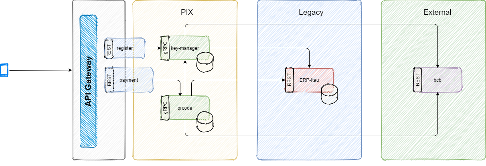

# Desafio: Pix

Recentemente o Banco Central do Brasil (BCB) trouxe ao mercado o **Pix**. Em poucas palavras, o Pix é um novo meio de pagamentos para fazer transferências de forma rápida, sem esperar dias para que o pagamento “caia” na conta de quem o receberá ou ter que fazê-los só em dias da semana, no horário comercial. Além de poder transferir dinheiro para outras pessoas, será possível também fazer pagamentos a estabelecimentos usando o Pix, por exemplo.

Com o Pix, pagamentos e transferências são **concluídos em alguns segundos** e podem ser feitos a qualquer horário e dia, incluindo finais de semana e feriados. O Pix vai, portanto, facilitar e agilizar as transferências de valores entre pessoas e estabelecimentos comerciais, o pagamento de contas e até recolhimento de impostos e taxas de serviços, entre outras possibilidades.

Vale dizer que para enviar ou receber um Pix, não é necessário fazer nenhum cadastro ou baixar um aplicativo – ele pode ser usado diretamente no aplicativo de sua instituição; é necessário somente que ela ofereça esse meio de pagamento. 

Dessa forma, nosso **objetivo** é garantir que nossos usuários possam efetuar pagamentos e transferências via Pix na nossa plataforma. Mais ainda, nossos usuários poderão registrar suas chaves Pix em nossa plataforma usando suas informações pessoais: CPF, telefone celular, email ou uma chave aleatória. Com uma chave registrada, será possível receber e pagar via Pix.

# Entendendo a Arquitetura do Projeto

# Outras informações 

[Bacen Open-API: Pix](https://github.com/bacen/pix-dict-api/tree/master/openapi)

# Indice

    00 - Desafio: Pix
    01 - Arquitetura do projeto e tecnologias
        01.1 - Setup do ambiente
    02 - Modulo Key-Manager
        02.1 - Setup do projeto: key-manager-grpc
        02.2 - Registrando uma nova chave Pix
        02.3 - Removendo uma chave Pix existente
        02.4 - Registrando e excluindo chaves Pix no Banco Central (BCB)
        02.5 - Consultando os dados de uma chave Pix
        02.6 - Setup do projeto: key-manager-rest
        02.7 - Expondo para o frontend: Registro da chave Pix
        02.8 - Expondo para o frontend: Remoção de uma chave Pix existente
    03 - Modulo Payment (Cobrança)
        03.1 - Setup do projeto: payment-grpc
        03.2 - Gerando uma cobrança via Pix para QR Code
        03.3 - Pagando uma cobrança via Pix
        03.4 - Setup do projeto: payment-rest
        03.5 - Expondo para o frontend: Gerando cobranças via Pix para QR Code
        03.6 - Expondo para o frontend: Pagando cobranças via Pix
    04 - Segurança
        04.1 - Autenticação e Autorização
        04.2 - Validando a chave Pix do usuário logado
    05 - Resiliência e Disponibilidade
        05.1 - O que acontece se o microservice Payment ficar fora do ar?
        05.2 - O que acontece se o microservice Key-Manager ficar fora do ar?
        05.3 - Melhorando a disponibilidade do microservice Payment através de Cache Distribuído
        05.4 - Definindo timeout para todas as chamadas remotas
        05.5 - Lidando com falhas parciais e transientes: habilitando Retry